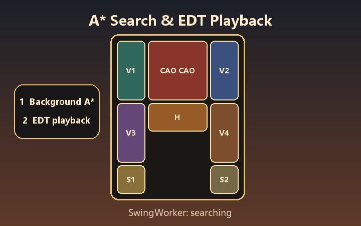

<div align="center">
  <p>
    <a href="README_ZH.md"></a>
    <a href="README.md"></a>
  </p>

  <h1>KlotskiPuzzle</h1>

  <p><strong>A playable Java 22+ Huarong Dao game and explainable algorithm lab: move the pieces, inspect the search, replay solutions, and reproduce experiments.</strong></p>

  <p>
    <a href="https://github.com/44-99/KlotskiPuzzle/actions/workflows/ci.yml"></a>
    <a href="https://github.com/44-99/KlotskiPuzzle/releases"></a>
    <a href="https://openjdk.org/projects/jdk/22/"></a>
    <a href="LICENSE"></a>
    <a href="https://github.com/44-99/KlotskiPuzzle/stargazers"></a>
  </p>

  <p>
    <a href="https://44-99.github.io/KlotskiPuzzle/">Project website</a> ·
    <a href="docs/ARCHITECTURE.md">Architecture</a> ·
    <a href="docs/ART_DIRECTION.md">Art direction</a> ·
    <a href="docs/V2_PLAN.md">V2 plan</a> ·
    <a href="ROADMAP.md">Roadmap</a> ·
    <a href="CHANGELOG.md">Changelog</a> ·
    <a href="CONTRIBUTING.md">Contributing</a> ·
    <a href="https://github.com/44-99/KlotskiPuzzle/discussions">Discussions</a>
  </p>

  

  <p><sub>This animation is generated from the project's actual threading and movement model and contains no third-party gameplay footage.</sub></p>
</div>

KlotskiPuzzle is a Java 22+ Swing implementation of Huarong Dao (Klotski) with two equal entry points: a playable puzzle and an explainable algorithm lab. It is built for algorithm learners, students, and Java developers who want to see not only whether a solver succeeds, but which states it expands, why candidates enter or leave the frontier, and how the resulting path changes the board.

The repository is not positioned as a production-ready commercial game. It demonstrates how to organize multi-cell movement rules, a playable UI, A* search, background work, animated playback, local saves, and automated tests into a project that can be run, verified, and extended.

The `v2.0.0-beta.1` preview contains separate Play Mode and Lab Mode lifecycles. Lab Mode provides deterministic search events, an inspectable expansion timeline, candidate-decision explanations, validated solution replay, and JSON Experiment Record export. Current `main` additionally provides a reproducible four-strategy CLI report with checked-in TSV and JSON evidence; that command was added after beta.1 and is not part of the published beta assets. The remaining stable-v2 scope is tracked in the [v2 plan](docs/V2_PLAN.md) and [domain context](CONTEXT.md).

## Why This Project Exists

Many Java course examples provide either a Swing interface or an isolated algorithm. The learner still has to solve several integration problems:

- A piece may occupy a 1×1, 1×2, 2×1, or 2×2 rectangle, making movement rules more involved than ordinary maze traversal;
- Separate player and solver rules quickly create cases where the UI accepts a move that the solver rejects;
- Running A* on the Swing event dispatch thread freezes the interface, while replaying the result introduces another lifecycle problem;
- Screenshots and source archives alone do not prove that a project builds, passes tests, or remains maintainable.

KlotskiPuzzle addresses these problems in one repository with explicit technical boundaries. It is intended for study, experimentation, and refactoring rather than submission as course work.

## Quick Start: Run the Java Swing Klotski Project

### Build the latest source

- JDK 22 or later;
- Maven 3.9 or later;
- A desktop environment capable of running Swing;

```bash
git clone https://github.com/44-99/KlotskiPuzzle.git
cd KlotskiPuzzle
mvn clean verify
mvn exec:java
```

The interface follows the operating-system language: Simplified Chinese systems use Chinese, while other systems use English. Override it explicitly when needed:

```bash
mvn exec:java -Dexec.args="--lang=en"
mvn exec:java -Dexec.args="--lang=zh-CN"
```

After building, the JAR can also be launched directly with the same language option:

```bash
java -jar target/klotski-puzzle-2.0.0-beta.1.jar --lang=en
```

Images and audio are packaged as classpath resources, so the JAR does not depend on the process working directory.

### Download the v2 preview

Open the [GitHub Releases page](https://github.com/44-99/KlotskiPuzzle/releases) and choose one of these assets:

- `KlotskiPuzzle-Windows-x64.zip` — portable Windows application with its own Java runtime; extract it and run `KlotskiPuzzle.exe`;
- `klotski-puzzle-2.0.0-beta.1.jar` — cross-platform executable JAR for systems with Java 22+;
- `SHA256SUMS.txt` — SHA-256 checksums for verifying both downloads.

The [project website](https://44-99.github.io/KlotskiPuzzle/) provides a shorter product overview before you download or inspect the source. This is a preview release: the implemented walkthrough, inspector, replay, and JSON export are usable, while the remaining stable-v2 work is listed explicitly below and in the roadmap.

The reproducible strategy report documented below belongs to current `main`, not to the `v2.0.0-beta.1` Windows package or JAR.

## What You Can Learn

| Question | Approach in this project | Start here |
|---|---|---|
| How should multi-cell pieces move? | A matrix represents the board, while a pure Java rules layer identifies pieces and enforces collisions, bounds, and the solved state | [`BoardRules.java`](src/main/java/model/BoardRules.java) |
| How can player and solver logic share rules? | Player actions and solver expansion both call `BoardRules.applyMove` | [`GameController.java`](src/main/java/controller/GameController.java), [`HuaRongDaoSolver.java`](src/main/java/model/HuaRongDaoSolver.java) |
| How can A* remain bounded and observable? | `PriorityQueue`, a best-known-step map, parent reconstruction, cancellation checks, and a discovered-state limit | [`HuaRongDaoSolver.java`](src/main/java/model/HuaRongDaoSolver.java) |
| How can Swing stay responsive? | An AI coordinator uses `SwingWorker` for search and `Swing Timer` for EDT playback | [`AiSolveCoordinator.java`](src/main/java/controller/AiSolveCoordinator.java) |
| How can a search decision be explained? | The shared runner emits deterministic `SearchExpansion` events containing state scores and accepted or rejected candidates | [`SearchExperimentRunner.java`](src/main/java/lab/SearchExperimentRunner.java), [`SearchExpansion.java`](src/main/java/lab/SearchExpansion.java) |
| How can results be reviewed and shared? | `SolutionReplay` validates every step, while a versioned JSON record includes the puzzle, strategy, outcome, path, metrics, and runtime environment | [`SolutionReplay.java`](src/main/java/lab/SolutionReplay.java), [`ExperimentRecord.java`](src/main/java/lab/ExperimentRecord.java) |
| How can strategies be compared without hand-copying metrics? | One CLI runs all four strategies under the same puzzle, move rule, state limit, and weight, then emits TSV and versioned JSON records | [Reproducible search report](docs/SEARCH_STRATEGY_REPORT.md), [`SearchStrategyReport.java`](src/main/java/cli/SearchStrategyReport.java) |
| How does course code become a verifiable project? | Maven builds it, JUnit 5 checks rules and paths, and GitHub Actions runs continuous integration with Java 22 | [`pom.xml`](pom.xml), [`src/test/java`](src/test/java) |
| How are local-data boundaries handled? | The start screen has no password accounts; legacy saves and rankings remain local under the user directory and future migration must be user-controlled | [`data`](src/main/java/data), [`0005-use-local-profiles-without-passwords.md`](docs/adr/0005-use-local-profiles-without-passwords.md) |

The AI execution flow is:

```text
Board snapshot -> AiSolveCoordinator -> SwingWorker -> A* -> Swing Timer -> BoardRules -> UI playback
```

The Lab explanation flow is:

```text
Puzzle Definition -> Search Experiment -> SearchExperimentRunner
                  -> Search Expansion events -> Search Overview / State Inspector
                  -> Result -> Solution Replay / JSON Experiment Record
```

## Playable Features

- A 5×4 Huarong Dao board with three built-in layouts;
- English and Simplified Chinese interfaces selected from the in-game language button, system locale, or `--lang`;
- Press-and-slide mouse gestures plus arrow-key and WASD controls;
- Background A* search with progress, cancellation, and animated playback;
- Deterministic BFS, Greedy Best-First, A*, and Weighted A* experiments under Cell Step or Piece Move rules;
- Search Overview metrics and a bounded inspectable expansion timeline;
- State Inspector explanations for candidate scores and accept/reject decisions;
- Solution Replay with previous, play/pause, next, and direct slider navigation;
- Versioned JSON Experiment Record export with puzzle identity, configuration, path, metrics, and runtime context;
- A reproducible current-`main` CLI comparison that writes one TSV table and four reviewable JSON records;
- Undo, restart, and a 180-second timed challenge;
- A password-free Play/Lab start screen; optional local Player Profiles remain v2 work;
- Original background music plus selection, move, invalid-move, undo, victory, and defeat effects.

Lab Mode records the first 150 expansions plus deterministic 500-expansion milestones for interactive inspection, while aggregate result metrics remain exact. The CLI comparison report is implemented; complete compressed traces, puzzle import/export, an interactive side-by-side comparison, and read-only HTML reports remain v2 work tracked in the [v2 plan](docs/V2_PLAN.md).

## Controls and Local Data

1. Choose Play Mode or Algorithm Lab on the password-free start screen;
2. In Play Mode, choose a layout and press a piece;
3. Slide in one direction to move one cell, or use the arrow keys / WASD;
4. Use the undo action to revert a move and the AI action to start or stop playback;
5. In Lab Mode, run an experiment, inspect expansions, replay the solution, or export its JSON record.

Legacy saves and leaderboard data use `${user.home}/.klotski-puzzle/`. Password accounts have been removed. Released v2 builds will offer explicit import, skip, or delete choices for legacy data; they must never silently delete user files. Optional password-free Player Profiles are not implemented yet.

## Project Structure

```text
KlotskiPuzzle/
├── src/main/java/
│   ├── cli/          # Copy-paste solver metrics report
│   ├── controller/   # Game session plus AI search/playback lifecycle
│   ├── data/         # Legacy rankings and recoverable saves
│   ├── lab/          # Search experiments, events, replay, and record export
│   ├── model/        # Board model, layouts, movement rules, and A* solver
│   ├── util/         # Classpath resources and background-music lifecycle
│   └── view/         # Swing windows and components
├── src/test/java/    # JUnit 5 tests
├── resources/original/ # Redistributable original runtime assets
├── docs/             # Architecture notes and project visuals
├── tools/            # Original image, GIF, music, and sound generators
└── pom.xml           # Java 22 Maven build
```

The source uses pragmatic layers rather than strict MVC. `BoardRules` is the shared movement seam; `PuzzleDefinition` owns validated experiment rules; and `SearchExperimentRunner` keeps strategies, deterministic ordering, events, limits, metrics, and path reconstruction behind one interface. Lab views are split by stable product responsibility rather than one monolithic Swing panel. See the [architecture document](docs/ARCHITECTURE.md).

## Verification

```bash
mvn clean verify
```

Automated tests cover board integrity, legal and illegal movement, all four Lab strategies, both movement rules, deterministic expansion events, candidate decisions, validated solution replay, JSON Experiment Records, password-free start actions, the resizable Lab workspace and aligned action columns, recoverable saves, leaderboard recovery, and packaged resources. A resource test also protects the animated start background. See the CI badge at the top for the latest build result.

Move counts plus expanded/discovered-state baselines for all three presets are recorded in [solver benchmarks](docs/SOLVER_BENCHMARKS.md). Performance changes should be compared under the same move definition.

The [reproducible four-strategy report](docs/SEARCH_STRATEGY_REPORT.md) fixes the tutorial layout, Cell Step rule, 250,000-state limit, and Weighted A* weight at 1.5. Its checked-in result compares BFS, Greedy Best-First, A*, and Weighted A* without treating machine-dependent elapsed time as a deterministic claim:


Run the same current-`main` report and print TSV locally:

```bash
mvn -q exec:java -Dexec.mainClass=cli.SearchStrategyReport -Dexec.args="tutorial cell-step"
```

Print complete metrics for the current machine without editing a test:

```bash
mvn -q exec:java -Dexec.mainClass=cli.SolverMetricsReport
```

## Project Boundaries

- The project requires Java 22+ and targets desktop environments that support Swing;
- A* keeps at most 250,000 discovered states by default and reports the limit explicitly. One move means translating one piece by one cell; the project does not claim results under every alternative counting convention;
- Lab Mode uses a themed user-resizable split workspace with continuous drag feedback and 1280×720 coverage; Play Mode still contains legacy absolute positioning, so broader small-screen and high-DPI support remains incomplete;
- Optional Player Profiles are not implemented; legacy rankings and saves are local only, with no server-side authentication or cross-device synchronization;
- The current CLI comparison produces reviewable data files, while the interactive side-by-side Algorithm Comparison remains planned for stable v2;
- There is no free-form level editor yet; the difficulty dialog exposes three validated presets.

## Contributing

Read [CONTRIBUTING.md](CONTRIBUTING.md) and the public [roadmap](ROADMAP.md) before contributing. Useful areas include complete trace export, Puzzle Definition import/export, interactive comparison, Player Profile migration, HTML reports, GUI lifecycle tests, and deeper heuristic experiments. Use Issues for scoped work and Discussions for open-ended questions or ideas.

## License

The source code and programmatically generated original assets are licensed under the [MIT License](LICENSE). See [THIRD_PARTY_NOTICES.md](THIRD_PARTY_NOTICES.md) for generation and history-cleanup details.
