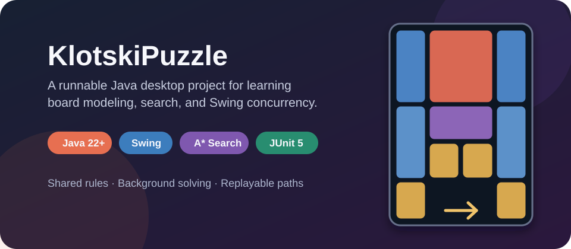

<div align="center">
  <p>
    <a href="README.md"></a>
    <a href="README_EN.md"></a>
  </p>

  <h1>KlotskiPuzzle</h1>

  <p><strong>Java 22+ Swing 华容道工程化学习项目：多格棋子建模、A* 自动求解与非阻塞动画回放。</strong></p>

  <p>
    <a href="https://github.com/44-99/KlotskiPuzzle/actions/workflows/ci.yml"></a>
    <a href="https://openjdk.org/projects/jdk/22/"></a>
    <a href="LICENSE"></a>
  </p>

  
</div>

KlotskiPuzzle 是一个从 Java GUI 课程项目演进而来的 Java 22+ Swing 华容道参考实现。它主要面向已经掌握 Java 基础、准备完成第一个 GUI 与算法综合项目的学生和初级开发者。

这个仓库的重点不是提供成熟的商业游戏客户端，而是展示如何把多格棋子规则、可玩的桌面界面、A* 搜索、后台任务、动画回放、本地存档和自动化测试组织成一个可运行、可验证、可继续改造的工程。

## 为什么有这个项目

很多 Java 课程示例只提供 Swing 界面或孤立的算法片段，读者仍需要自己解决几个关键问题：

- 一个棋子可能占据 1×1、1×2、2×1 或 2×2 个格子，移动规则比普通迷宫更难统一；
- 玩家操作与 AI 各写一套规则容易出现“界面能走、求解器不能走”的不一致；
- 把 A* 直接放在 Swing 事件线程会导致界面假死，求解完成后还需要安全地回放路径；
- 只有截图和源码压缩包无法证明项目能够构建、测试和继续维护。

KlotskiPuzzle 把这些问题放在同一个项目中解决，并保留清晰的技术边界，适合阅读、实验和重构，而不是直接作为课程作业提交。

## 快速开始

### 环境要求

- JDK 22 或更高版本；
- Maven 3.9 或更高版本；
- 支持 Swing 的桌面图形环境；
- Git LFS，用于检出动态背景素材。

```bash
git clone https://github.com/44-99/KlotskiPuzzle.git
cd KlotskiPuzzle
git lfs pull
mvn clean verify
mvn exec:java
```

构建完成后也可以直接运行 JAR：

```bash
java -jar target/klotski-puzzle-1.0.0-SNAPSHOT.jar
```

图片和音频作为 classpath 资源打入 JAR，运行时不依赖当前工作目录。

## 你能从中学到什么

| 核心问题 | 项目中的做法 | 推荐入口 |
|---|---|---|
| 多格棋子如何建模和移动 | 用矩阵表示棋盘，由纯 Java 规则层统一识别棋子、碰撞、边界和胜利状态 | [`BoardRules.java`](src/main/java/model/BoardRules.java) |
| 玩家与 AI 如何共用规则 | 玩家移动和求解器状态扩展都调用 `BoardRules.applyMove` | [`GameController.java`](src/main/java/controller/GameController.java)、[`HuaRongDaoSolver.java`](src/main/java/model/HuaRongDaoSolver.java) |
| 如何实现可控的 A* 搜索 | 使用 `PriorityQueue`、最优已知步数表、父状态回溯、取消检查和状态上限 | [`HuaRongDaoSolver.java`](src/main/java/model/HuaRongDaoSolver.java) |
| 如何避免 Swing 界面卡死 | `SwingWorker` 在后台搜索，`Swing Timer` 在 EDT 上逐步回放 | [`ControlPanel.java`](src/main/java/view/game/ControlPanel.java) |
| 如何把课程代码变成可验证工程 | Maven 统一构建，JUnit 5 验证规则与路径，GitHub Actions 使用 Java 22 持续集成 | [`pom.xml`](pom.xml)、[`src/test/java`](src/test/java) |
| 如何处理本地数据边界 | 玩家数据写入用户目录，密码使用 PBKDF2，存档和榜单采用临时文件替换 | [`data`](src/main/java/data) |

AI 执行链路可以概括为：

```text
棋盘快照 -> SwingWorker -> A* 搜索 -> 求解结果 -> Swing Timer -> BoardRules -> 界面回放
```

## 可玩功能

- 5×4 华容道棋盘和三种内置布局；
- 键盘、WASD、鼠标及界面方向按钮操作；
- A* 后台求解、搜索进度、取消与动画回放；
- 撤销、重新开始和 180 秒限时挑战；
- 本地玩家、游戏存档、步数榜和时间榜；
- 背景音乐与移动、胜利、失败音效。

## 操作与本地数据

1. 创建本地玩家，或选择游客模式；
2. 选择布局并点击棋子；
3. 使用方向键、WASD 或方向按钮移动；
4. 使用“撤军回防”撤销，“军师献策”启动或停止 AI；
5. 登录玩家可以保存进度，游客数据不会持久化。

玩家、存档和排行榜数据保存在 `${user.home}/.klotski-puzzle/`。这是单机档案系统，不是联网账号服务；Base64 只用于棋盘存档编码，不是加密。

## 代码结构

```text
KlotskiPuzzle/
├── src/main/java/
│   ├── controller/   # 玩家操作、动画、存档与胜负流程
│   ├── data/         # 本地数据路径与玩家凭据
│   ├── model/        # 棋盘模型、布局、移动规则与 A* 求解器
│   ├── util/         # classpath 资源与背景音乐生命周期
│   └── view/         # Swing 窗口和组件
├── src/test/java/    # JUnit 5 测试
├── resources/        # 运行素材和演示文件
├── docs/             # 文档与项目视觉素材
└── pom.xml           # Java 22 Maven 构建
```

源码按 `model`、`controller` 和 `view` 粗粒度分包，但并非严格 MVC：控制器目前仍承担部分音频、存档、榜单和弹窗职责。这也是适合继续练习职责拆分的地方。

## 验证

```bash
mvn clean verify
```

自动化测试覆盖棋盘完整性、四类棋子的合法与非法移动、内置布局求解与路径回放、取消和状态上限、本地密码哈希、排行榜容错以及打包资源。登录背景测试还会防止动态 GIF 意外退化为静态图；最新构建结果以页面顶部的 CI 徽章为准。

## 项目边界

- 项目要求 Java 22+，只面向支持 Swing 的桌面环境；
- A* 默认最多保留 250,000 个已发现状态，达到上限会停止并明确提示；目前尚未建立标准关卡的峰值内存和最优步数基准；
- 界面仍使用固定窗口和绝对坐标，小屏幕及高 DPI 适配有限；
- 榜单、玩家和存档都是本地数据，不提供服务端认证或跨设备同步；
- 当前音乐、视频/GIF 和英雄图片没有可验证的再分发授权。公开演示或发布二进制包前必须替换为原创、CC0 或明确允许再分发的素材，详见 [`THIRD_PARTY_NOTICES.md`](THIRD_PARTY_NOTICES.md)。

## 参与贡献

请先阅读 [CONTRIBUTING.md](CONTRIBUTING.md)。适合的改进方向包括求解器基准、GUI 集成测试、职责拆分、响应式布局和合规素材替换。

## 许可证

源代码采用 [MIT License](LICENSE)。`resources/` 中的媒体素材不自动适用 MIT，详情见 [THIRD_PARTY_NOTICES.md](THIRD_PARTY_NOTICES.md)。
