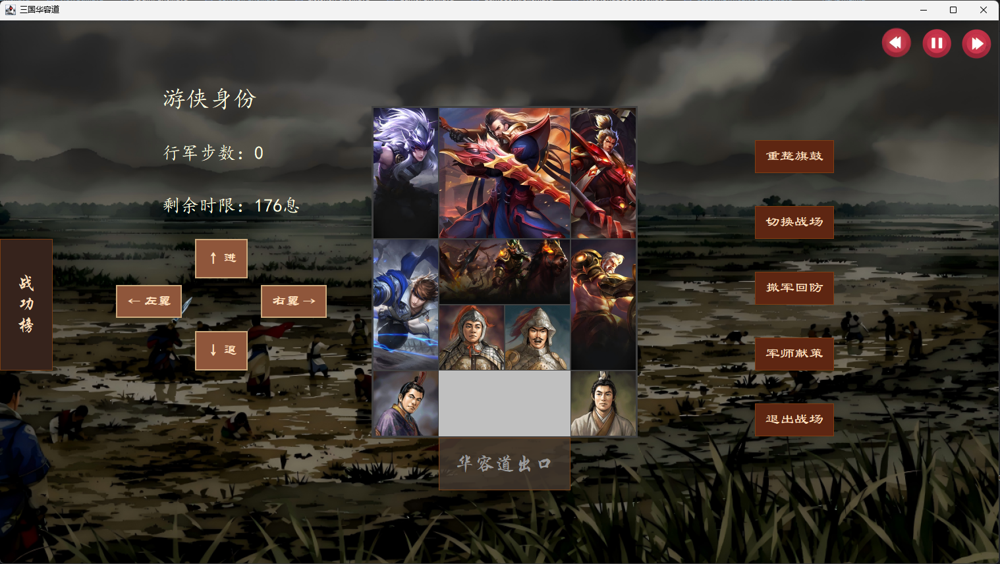

<p align="right">
  <a href="README.md"></a>
  <a href="README_EN.md"></a>
</p>

# KlotskiPuzzle

[](https://github.com/44-99/KlotskiPuzzle/actions/workflows/ci.yml)
[](https://openjdk.org/projects/jdk/22/)
[](https://maven.apache.org/)
[](LICENSE)
[](https://github.com/44-99/KlotskiPuzzle/stargazers)

**A Java 22 and Swing implementation of the classic Huarong Dao (Klotski) puzzle, featuring A* solving and animated playback.**

The project combines a complete playable desktop interface with shared board rules, undo and local saves, timed challenges, leaderboards, and automated tests. It is intended as a learning-oriented reference for Java desktop development and search algorithms, not as a production-ready commercial game.



[Watch the AI solver demo](resources/assets/AI演示.mp4)

## Features

- A 5×4 Huarong Dao board with three built-in layouts;
- Keyboard, WASD, mouse, and on-screen directional controls;
- Background A* search with Swing Timer playback;
- Undo, restart, and a 180-second timed challenge;
- Local players, game saves, step rankings, and time rankings;
- Background music plus move, victory, and defeat sound effects.

## Technical Design

| Area | Implementation | Why |
|---|---|---|
| Runtime | Java 22+ | A single build and CI baseline; the code uses Sequenced Collections APIs introduced in Java 21 |
| Desktop UI | Swing | Preserves the original local desktop application without adding another UI runtime |
| Build | Maven | Reproducible compilation, testing, resource packaging, and executable JAR creation |
| Game rules | `model.BoardRules`, `model.Difficulty` | Player actions and the solver share the same rules; real game boards are validated for 5×4 dimensions, piece shapes, and counts |
| Solver | A*, `PriorityQueue`, best-known-step map, state limit | Returns a replayable path, an explicit result status, and search metrics while bounding memory use on custom dead ends |
| Swing concurrency | `SwingWorker`, `Swing Timer` | Search runs off the event dispatch thread while playback remains on the EDT |
| Background music | Single-threaded `BackgroundMusicPlayer` | Serializes pause, track changes, and natural advancement while closing old streams and clips |
| Local data | User home directory, PBKDF2, temporary-file replacement | Keeps local-player support without plaintext passwords or writes into the source tree |
| Tests | JUnit 5, GitHub Actions | Verifies rules, solver results, local credentials, leaderboards, and packaged resources |

The source is grouped into `model`, `controller`, and `view`, but this is intentionally described as a coarse separation rather than strict MVC: the controller still owns parts of audio, saves, leaderboards, and dialogs.

## Run the Project

### Requirements

- JDK 22 or later;
- Maven 3.9 or later;
- A desktop environment capable of running Swing;
- Git LFS to check out the animated background assets.

### Run from Source

```bash
git clone https://github.com/44-99/KlotskiPuzzle.git
cd KlotskiPuzzle
git lfs pull
mvn clean verify
mvn exec:java
```

### Run the Packaged JAR

```bash
java -jar target/klotski-puzzle-1.0.0-SNAPSHOT.jar
```

Images and audio are packaged as classpath resources, so the JAR does not depend on the process working directory.

## Controls

1. Create a local player or continue as a guest;
2. Choose a layout and select a piece;
3. Move with the arrow keys, WASD, or the on-screen buttons;
4. Use the undo action to revert a move and the AI action to start or stop solver playback;
5. Signed-in local players can save progress; guest progress is not persisted.

Player accounts, saves, and leaderboard data are stored in `${user.home}/.klotski-puzzle/`. This is a local profile system, not an online account service. Base64 is used only as a save-data encoding and is not encryption.

## Project Structure

```text
KlotskiPuzzle/
├── src/main/java/
│   ├── controller/   # Player actions, animation, saves, and game completion
│   ├── data/         # Local data paths and player credentials
│   ├── model/        # Board model, difficulty presets, rules, and A* solver
│   ├── util/         # Classpath resources and background-music lifecycle
│   └── view/         # Swing windows and components
├── src/test/java/    # JUnit 5 tests
├── resources/        # Images, audio, and demo media
├── docs/             # Design notes and article planning
└── pom.xml           # Java 22 Maven build
```

Recommended entry points:

- [`model/BoardRules.java`](src/main/java/model/BoardRules.java) — piece discovery, legal moves, and the solved-state check;
- [`model/HuaRongDaoSolver.java`](src/main/java/model/HuaRongDaoSolver.java) — A* state expansion, result statuses, limits, and path reconstruction;
- [`controller/GameController.java`](src/main/java/controller/GameController.java) — player moves, animation, and save flow;
- [`view/game/ControlPanel.java`](src/main/java/view/game/ControlPanel.java) — background solving and playback orchestration;
- [`src/test/java`](src/test/java) — current automated tests.

## Tests

```bash
mvn clean verify
```

The 23 tests cover legal and illegal movement for all four piece types, full game-board validation, defensive model copies, time-bounded solving and legal path replay for all three built-in layouts, solved/no-solution/cancelled/state-limit solver results, local password hashing, leaderboard recovery, and packaged resources. The login-background test also verifies that the optimized GIF still contains multiple frames. CI runs on Temurin JDK 22.

## Known Limitations

- The executable JAR is approximately 68.3 MiB. The login screen retains the complete 35-second animation through an optimized 768×432, 8 FPS, 64-color GIF. The repository keeps the approximately 308 MiB 1080p source in Git LFS, but the original is not duplicated inside the JAR;
- All three built-in layouts have a five-second regression limit, legal-path replay checks, and expanded/discovered-state metrics, but there is no peak-memory or optimal-move benchmark yet;
- The AI button displays the discovered-state count and keeps at most 250,000 states by default. Reaching the limit produces a dedicated result instead of being reported as no solution;
- The Swing interface still relies on a fixed window and absolute coordinates, so small-screen and high-DPI support is limited;
- Leaderboards and saves use local text formats and do not synchronize across devices;
- Local login exists only to separate single-machine profiles and must not be treated as server-side authentication;
- The current music came from personal VIP offline downloads, the GIF/video came from Bilibili game videos, and the hero images came from browser-search screenshots. None of these sources grants documented redistribution rights. Replace the media before using a public repository or binary release; see [`THIRD_PARTY_NOTICES.md`](THIRD_PARTY_NOTICES.md).

## Contributing

See [CONTRIBUTING.md](CONTRIBUTING.md). Useful contribution areas include solver benchmarks, GUI integration tests, responsibility separation, responsive layouts, and replacement media with documented redistribution rights.

## License

The source code is licensed under the [MIT License](LICENSE). Media under `resources/` is not automatically covered by MIT; see [THIRD_PARTY_NOTICES.md](THIRD_PARTY_NOTICES.md).
