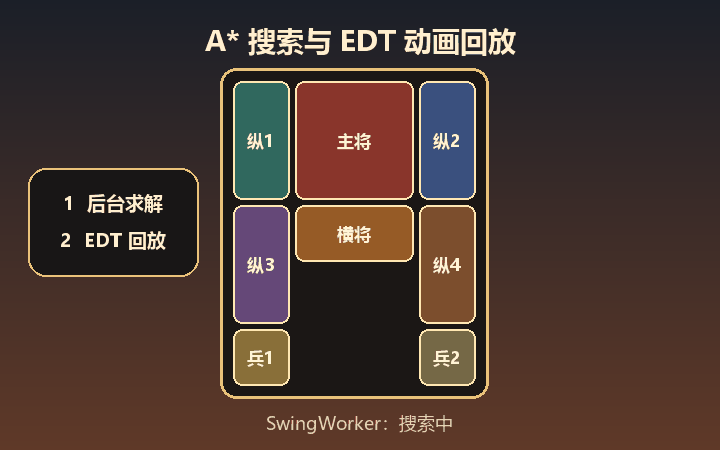
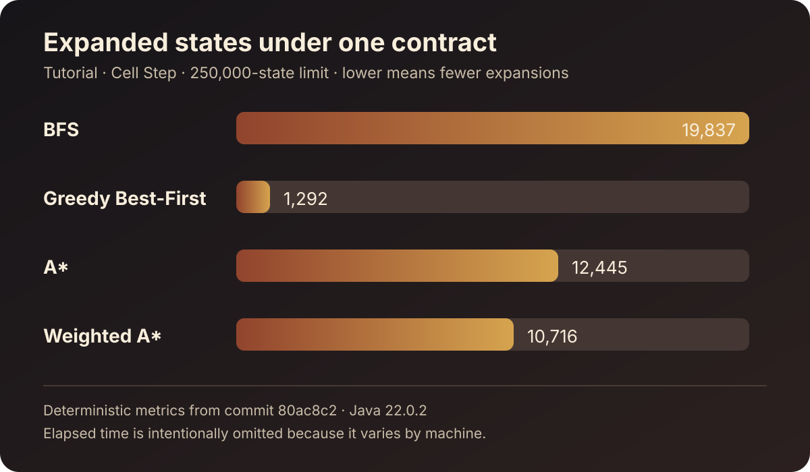

<div align="center">
  <p>
    <a href="README_ZH.md"></a>
    <a href="README.md"></a>
  </p>

  <h1>KlotskiPuzzle</h1>

  <p><strong>能直接玩的 Java 22+ 华容道，也是可解释的算法实验室：移动棋子、检查搜索、回放解法并复现实验。</strong></p>

  <p>
    <a href="https://github.com/44-99/KlotskiPuzzle/actions/workflows/ci.yml"></a>
    <a href="https://github.com/44-99/KlotskiPuzzle/releases"></a>
    <a href="https://openjdk.org/projects/jdk/22/"></a>
    <a href="LICENSE"></a>
    <a href="https://github.com/44-99/KlotskiPuzzle/stargazers"></a>
  </p>

  <p>
    <a href="https://44-99.github.io/KlotskiPuzzle/">项目主页</a> ·
    <a href="docs/ARCHITECTURE.md">架构说明</a> ·
    <a href="docs/ART_DIRECTION.md">视觉与音频规范</a> ·
    <a href="docs/V2_PLAN.md">V2 规划</a> ·
    <a href="ROADMAP.md">开发路线</a> ·
    <a href="CHANGELOG.md">更新记录</a> ·
    <a href="CONTRIBUTING_ZH.md">参与贡献</a> ·
    <a href="https://github.com/44-99/KlotskiPuzzle/discussions">讨论区</a>
  </p>

  

  <p><sub>该动图由项目脚本按真实线程与移动模型生成，不含第三方游戏画面。</sub></p>
</div>

KlotskiPuzzle 是一个 Java 22+ Swing 华容道实现，提供两个平级入口：可直接游玩的小游戏，以及可解释的算法实验室。它主要面向算法学习者、学生和 Java 开发者：不仅展示求解器是否成功，还展示它展开了哪些状态、候选状态为什么进入或离开搜索前沿，以及最终路径如何改变棋盘。

这个仓库的重点不是提供成熟的商业游戏客户端，而是展示如何把多格棋子规则、可玩的桌面界面、A* 搜索、后台任务、动画回放、本地存档和自动化测试组织成一个可运行、可验证、可继续改造的工程。

`v2.0.0-beta.1` 预览版已经分离 Play Mode 与 Lab Mode 的生命周期。Lab Mode 已提供确定性搜索事件、可检查的展开时间线、候选决策解释、经过验证的解法回放和 JSON 实验记录导出。当前 `main` 还提供可复现的四策略命令行报告及已提交的 TSV、JSON 证据；该命令在 beta.1 之后加入，不包含在已发布的 beta 安装包中。稳定版 v2 的剩余范围记录在 [v2 规划](docs/V2_PLAN.md) 与 [领域上下文](CONTEXT.md) 中。

## 为什么有这个项目

很多 Java 课程示例只提供 Swing 界面或孤立的算法片段，读者仍需要自己解决几个关键问题：

- 一个棋子可能占据 1×1、1×2、2×1 或 2×2 个格子，移动规则比普通迷宫更难统一；
- 玩家操作与 AI 各写一套规则容易出现“界面能走、求解器不能走”的不一致；
- 把 A* 直接放在 Swing 事件线程会导致界面假死，求解完成后还需要安全地回放路径；
- 只有截图和源码压缩包无法证明项目能够构建、测试和继续维护。

KlotskiPuzzle 把这些问题放在同一个项目中解决，并保留清晰的技术边界，适合阅读、实验和重构，而不是直接作为课程作业提交。

## 快速开始：运行 Java Swing 华容道完整项目

### 构建最新源码

- JDK 22 或更高版本；
- Maven 3.9 或更高版本；
- 支持 Swing 的桌面图形环境；

```bash
git clone https://github.com/44-99/KlotskiPuzzle.git
cd KlotskiPuzzle
mvn clean verify
mvn exec:java
```

程序会根据操作系统语言自动选择界面：简体中文系统使用中文，其他系统默认英文。也可以显式指定：

```bash
mvn exec:java -Dexec.args="--lang=zh-CN"
mvn exec:java -Dexec.args="--lang=en"
```

构建完成后也可以使用相同参数直接运行 JAR：

```bash
java -jar target/klotski-puzzle-2.0.0-beta.1.jar --lang=zh-CN
```

图片和音频作为 classpath 资源打入 JAR，运行时不依赖当前工作目录。

### 下载 v2 预览版

打开 [GitHub Releases 页面](https://github.com/44-99/KlotskiPuzzle/releases)，按使用环境选择：

- `KlotskiPuzzle-Windows-x64.zip`：自带 Java 运行时的 Windows 免安装包，解压后运行 `KlotskiPuzzle.exe`；
- `klotski-puzzle-2.0.0-beta.1.jar`：适合已安装 Java 22+ 的跨平台可执行 JAR；
- `SHA256SUMS.txt`：用于校验上述两个下载文件的 SHA-256。

[项目主页](https://44-99.github.io/KlotskiPuzzle/) 提供更精简的功能说明和下载入口。本次是预览版：搜索讲解、状态检查、解法回放和 JSON 导出已经可用，稳定 v2 尚未完成的部分会在下文和路线图中明确列出。

下文的四策略复现实验属于当前 `main`，不属于 `v2.0.0-beta.1` Windows 包或 JAR。

## 你能从中学到什么

| 核心问题 | 项目中的做法 | 推荐入口 |
|---|---|---|
| 多格棋子如何建模和移动 | 用矩阵表示棋盘，由纯 Java 规则层统一识别棋子、碰撞、边界和胜利状态 | [`BoardRules.java`](src/main/java/model/BoardRules.java) |
| 玩家与 AI 如何共用规则 | 玩家移动和求解器状态扩展都调用 `BoardRules.applyMove` | [`GameController.java`](src/main/java/controller/GameController.java)、[`HuaRongDaoSolver.java`](src/main/java/model/HuaRongDaoSolver.java) |
| 如何实现可控的 A* 搜索 | 使用 `PriorityQueue`、最优已知步数表、父状态回溯、取消检查和状态上限 | [`HuaRongDaoSolver.java`](src/main/java/model/HuaRongDaoSolver.java) |
| 如何避免 Swing 界面卡死 | AI 协调器用 `SwingWorker` 后台搜索、`Swing Timer` 在 EDT 上逐步回放 | [`AiSolveCoordinator.java`](src/main/java/controller/AiSolveCoordinator.java) |
| 如何解释一次搜索决策 | 共享运行器产生确定性的 `SearchExpansion` 事件，包含状态评分和每个候选的接受/拒绝原因 | [`SearchExperimentRunner.java`](src/main/java/lab/SearchExperimentRunner.java)、[`SearchExpansion.java`](src/main/java/lab/SearchExpansion.java) |
| 如何复查和分享实验结果 | `SolutionReplay` 验证每一步，版本化 JSON 记录包含关卡、策略、结果、路径、指标和运行环境 | [`SolutionReplay.java`](src/main/java/lab/SolutionReplay.java)、[`ExperimentRecord.java`](src/main/java/lab/ExperimentRecord.java) |
| 如何避免手工抄写算法对比数据 | 一个 CLI 在相同关卡、移动规则、状态上限和权重下运行四种策略，并输出 TSV 与版本化 JSON | [可复现搜索报告](docs/SEARCH_STRATEGY_REPORT.md)、[`SearchStrategyReport.java`](src/main/java/cli/SearchStrategyReport.java) |
| 如何把课程代码变成可验证工程 | Maven 统一构建，JUnit 5 验证规则与路径，GitHub Actions 使用 Java 22 持续集成 | [`pom.xml`](pom.xml)、[`src/test/java`](src/test/java) |
| 如何处理本地数据边界 | 开始页不再提供密码账号；旧存档和榜单仍位于用户目录，未来迁移必须由用户主动选择 | [`data`](src/main/java/data)、[`0005-use-local-profiles-without-passwords.md`](docs/adr/0005-use-local-profiles-without-passwords.md) |

AI 执行链路可以概括为：

```text
棋盘快照 -> AiSolveCoordinator -> SwingWorker -> A* -> Swing Timer -> BoardRules -> 界面回放
```

Lab 解释链路可以概括为：

```text
关卡定义 -> 搜索实验 -> SearchExperimentRunner
        -> 状态展开事件 -> 搜索概览 / 状态检查器
        -> 实验结果 -> 解法回放 / JSON 实验记录
```

## 可玩功能

- 5×4 华容道棋盘和三种内置布局；
- 通过游戏内语言按钮、系统语言或 `--lang` 参数选择英文、简体中文界面；
- 按住滑动手势，以及方向键和 WASD 操作；
- A* 后台求解、搜索进度、取消与动画回放；
- 在单格步或整段移动规则下运行确定性的 BFS、贪心最佳优先、A* 和加权 A* 实验；
- 搜索概览指标和有边界的可检查展开时间线；
- 状态检查器：解释候选评分及其接受/拒绝原因；
- 解法回放：上一步、播放/暂停、下一步和滑块跳转；
- 版本化 JSON 实验记录：包含关卡身份、配置、路径、指标和运行环境；
- 当前 `main` 可运行四策略复现报告，生成一份 TSV 表格和四份可复查 JSON 记录；
- 撤销、重新开始和 180 秒限时挑战；
- 无密码的 Play/Lab 开始页；可选本地玩家档案仍属于 v2 工作；
- 原创背景音乐，以及选中、移动、非法移动、撤销、胜利和失败音效。

Lab Mode 会保留前 150 次展开和每 500 次展开的确定性里程碑用于交互检查，汇总结果指标仍然精确。命令行四策略报告已经实现；完整压缩轨迹、关卡导入导出、交互式并排算法对比和只读 HTML 报告仍属于 [v2 规划](docs/V2_PLAN.md) 中的后续工作。

## 操作与本地数据

1. 在无密码开始页选择“开始游玩”或“算法实验室”；
2. 在 Play Mode 中选择布局并按住棋子；
3. 向一个方向滑动即可移动一格，也可使用方向键或 WASD；
4. 使用“撤销一步”回退操作，使用“AI 求解”启动或停止搜索与回放；
5. 在 Lab Mode 中运行实验、检查展开状态、回放解法或导出 JSON 记录。

旧存档和排行榜数据使用 `${user.home}/.klotski-puzzle/`。密码账号已经删除。正式 v2 只会向用户提供“导入、跳过或删除”的明确选择，绝不会静默删除旧数据；无密码的可选玩家档案尚未实现。

## 代码结构

```text
KlotskiPuzzle/
├── src/main/java/
│   ├── cli/          # 可复制运行的求解器指标报告
│   ├── controller/   # 游戏会话，以及 AI 搜索/回放生命周期
│   ├── data/         # 旧榜单与可恢复存档
│   ├── lab/          # 搜索实验、事件、回放与记录导出
│   ├── model/        # 棋盘模型、布局、移动规则与 A* 求解器
│   ├── util/         # classpath 资源与背景音乐生命周期
│   └── view/         # Swing 窗口和组件
├── src/test/java/    # JUnit 5 测试
├── resources/original/ # 可再分发的原创运行素材
├── docs/             # 架构说明与项目视觉素材
├── tools/            # 原创图片、GIF、音乐和音效生成脚本
└── pom.xml           # Java 22 Maven 构建
```

源码采用务实的分层设计而非严格 MVC：`BoardRules` 是共享移动 seam，`PuzzleDefinition` 负责经过验证的实验规则，`SearchExperimentRunner` 在一个接口后封装策略、确定性排序、事件、限制、指标和路径重建。Lab 视图按稳定产品职责拆分，不再由单个 Swing 大面板承担全部工作。详见 [架构文档](docs/ARCHITECTURE.md)。

## 验证

```bash
mvn clean verify
```

自动化测试覆盖棋盘完整性、合法与非法移动、四种 Lab 策略、两种移动规则、确定性展开事件、候选决策、经过验证的解法回放、JSON 实验记录、无密码开始页、可拖动 Lab 工作区及按钮列对齐、可恢复存档、排行榜容错以及打包资源。资源测试还会保护开始页动态背景；最新构建结果以页面顶部的 CI 徽章为准。

三种内置布局的步数、展开状态和已发现状态基线记录在 [求解器基准](docs/SOLVER_BENCHMARKS.md) 中，性能改动应在相同计步规则下比较。

[四策略可复现报告](docs/SEARCH_STRATEGY_REPORT.md) 固定使用教学布局、单格步、250,000 状态上限，以及 1.5 的加权 A* 权重。已提交结果在不把机器相关耗时包装成确定性结论的前提下，对比 BFS、贪心最佳优先、A* 和加权 A*：



在当前 `main` 重新运行并直接打印 TSV：

```bash
mvn -q exec:java -Dexec.mainClass=cli.SearchStrategyReport -Dexec.args="tutorial cell-step"
```

无需修改测试即可打印当前机器上的完整指标：

```bash
mvn -q exec:java -Dexec.mainClass=cli.SolverMetricsReport
```

## 项目边界

- 项目要求 Java 22+，只面向支持 Swing 的桌面环境；
- A* 默认最多保留 250,000 个已发现状态，达到上限会停止并明确提示；“一步”定义为一个棋子平移一格，不宣称覆盖所有计步规则；
- Lab Mode 使用自绘、可由用户调整且拖动实时跟随的分栏，并覆盖 1280×720；Play Mode 仍含旧式绝对坐标，更广泛的小屏幕和高 DPI 适配尚未完成；
- 可选玩家档案尚未实现；旧榜单和存档仅限本地，不提供服务端认证或跨设备同步；
- 当前命令行报告已经能生成可复查的数据文件，交互式并排 Algorithm Comparison 仍计划在稳定 v2 完成；
- 当前没有真正的自由关卡编辑器，难度窗口提供的是三种经过校验的预设布局。

## 参与贡献

请先阅读 [CONTRIBUTING_ZH.md](CONTRIBUTING_ZH.md) 和公开的 [开发路线](ROADMAP.md)。适合的改进方向包括完整轨迹导出、关卡定义导入导出、交互式算法对比、玩家档案迁移、HTML 报告、GUI 生命周期测试和更深入的启发式实验。问题请提交到 Issues，开放式想法与使用交流请放到 Discussions。

## 许可证

源代码和仓库内程序化生成的原创素材均采用 [MIT License](LICENSE)。素材生成方式与历史清理说明见 [THIRD_PARTY_NOTICES.md](THIRD_PARTY_NOTICES.md)。
