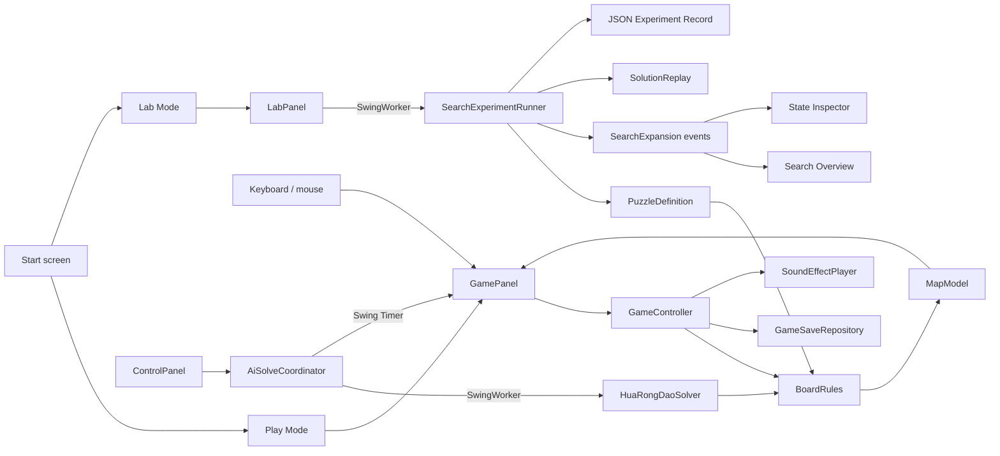

# KlotskiPuzzle architecture

KlotskiPuzzle is intentionally small enough to read as a learning project, while keeping blocking work and persistence outside Swing views. It is a pragmatic layered design rather than strict textbook MVC.

## Runtime flow

The important boundary is `BoardRules`: both player moves and solver expansion call the same pure Java function. A move therefore cannot be legal only in the UI or only in the solver.

## Package responsibilities

| Package | Responsibility |
|---|---|
| `cli` | Copy-paste diagnostics and reports that reuse the application model |
| `model` | Board representation, validation, movement rules, presets, and bounded A* search |
| `controller` | A game session plus AI search/playback coordination |
| `lab` | Deterministic experiment configuration, search events, candidate decisions, replay validation, metrics, and record export |
| `view` | Swing composition, rendering, input, and dialogs, including separate Lab explanation modules |
| `data` | Legacy rankings, save serialization, atomic replacement, and corrupt-file quarantine |
| `util` | Classpath resource loading and audio lifecycle |

## Threading model

- Swing components are created and updated on the event-dispatch thread (EDT).
- `AiSolveCoordinator` runs A* in a `SwingWorker`; progress is marshalled back to the EDT.
- `LabPanel` runs `SearchExperimentRunner` in a separate `SwingWorker`; Lab Mode never creates a player, countdown, or leaderboard session.
- AI moves and piece animation use `javax.swing.Timer`, so component updates remain on the EDT.
- Background music has one serialized executor. Short sound effects use Java virtual threads so opening an audio line does not block input handling.
- Cancelling AI interrupts the worker; the solver checks the interrupt flag during search and neighbor generation.

## Solver state

V2 introduces a deeper experiment seam alongside the legacy gameplay solver. `PuzzleDefinition` owns validated 5x4 content identity, movement-rule behavior, stable successor ordering, and state compatibility. `PuzzleState` is an immutable value snapshot. `SearchExperimentRunner` owns strategy scoring, deterministic tie-breaking, cancellation, state limits, metrics, path reconstruction, and exact `SearchExpansion` events behind one `run` interface.

`SearchExpansion` records the expanded state, `g`, `h`, priority, frontier observations, and every legal candidate with an explicit `DISCOVERED`, `IMPROVED`, `REJECTED_NOT_BETTER`, or `STATE_LIMIT_REACHED` decision. Lab Mode retains the first 150 expansions plus every 500th milestone for interactive inspection; observers and tests may request the complete event stream. This sampling is a UI memory policy, not solver behavior.

`SolutionReplay` validates the returned path once and exposes immutable state snapshots for previous/next/autoplay controls. `ExperimentRecord` captures the reproducible configuration, outcome, solution, deterministic metrics, elapsed observation, and runtime environment; `ExperimentRecordJson` is serialization only and never reimplements search.

The legacy `HuaRongDaoSolver` remains the current Play Mode adapter while Lab Mode matures; stable v2 will remove duplicated solver behavior rather than maintain two independent rule implementations.

`State` is an immutable search node with separate values for:

- `steps` (`g`): path cost from the initial board;
- `estimatedRemainingSteps` (`h`): Manhattan-distance lower bound for the 2×2 target piece;
- `priority` (`f = g + h`): ordering in the priority queue.

Board equality and a cached hash identify duplicate positions. `HuaRongDaoSolver` also keeps the best known `g` value for each position and refuses to discover more than 250,000 states by default. This bounds the search but means a difficult layout may stop with `STATE_LIMIT_REACHED`.

The solver treats one one-cell translation of a piece as one move. Claims about move counts are meaningful only under that definition.

## Lab view modules

`LabPanel` coordinates lifecycle only. Stable presentation responsibilities live in smaller modules:

- `ExperimentControlsPanel` owns puzzle, movement, strategy, weight, and run/cancel/export actions;
- `SearchOverviewPanel` owns aggregate progress and the inspectable expansion timeline;
- `StateInspectorPanel` explains one expansion and its candidate decisions;
- `SolutionReplayPanel` owns replay navigation and autoplay;
- `LabBoardView` renders the shared board used by selection, inspection, and replay.

The workspace uses a themed `JSplitPane` with a narrow custom divider, explicit minimum widths, and `continuousLayout` enabled. Users can resize the board and explanation areas while the content follows the pointer instead of updating only after release.

## Local data

Mutable data is stored under `${user.home}/.klotski-puzzle/`, never inside the JAR or source checkout.

- Password registration and login have been removed. The start screen enters Play Mode or Lab Mode directly.
- Saves store a readable board and a Base64-encoded validation copy for each step. Base64 is integrity-oriented encoding here, not encryption.
- Writes use a temporary file followed by atomic replacement when the file system supports it.
- An unrecoverable save is renamed with a `.corrupt-<timestamp>` suffix instead of being overwritten.
- Legacy user files are never silently deleted by released builds; future Player Profile migration must be explicit.

## Deliberate limits

- Lab Mode is covered at 1280×720 and uses a continuously updating resizable split workspace; Play Mode still contains legacy absolute positioning and is not yet fully high-DPI adaptive.
- Automated tests cover rules, solving, persistence, and packaged resources; full robot-driven GUI tests are not included.
- The project has three preset layouts rather than a validated free-form level editor.

These limits are kept explicit so follow-up contributions can target measurable improvements without presenting the repository as a production game engine.
