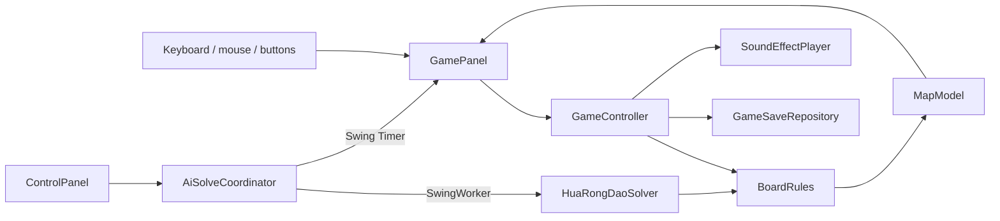

# KlotskiPuzzle architecture

KlotskiPuzzle is intentionally small enough to read as a learning project, while keeping blocking work and persistence outside Swing views. It is a pragmatic layered design rather than strict textbook MVC.

## Runtime flow

The important boundary is `BoardRules`: both player moves and solver expansion call the same pure Java function. A move therefore cannot be legal only in the UI or only in the solver.

## Package responsibilities

| Package | Responsibility |
|---|---|
| `cli` | Copy-paste diagnostics and reports that reuse the application model |
| `model` | Board representation, validation, movement rules, presets, and bounded A* search |
| `controller` | A game session plus AI search/playback coordination |
| `view` | Swing composition, rendering, input, and dialogs |
| `data` | User credentials, rankings, save serialization, atomic replacement, and corrupt-file quarantine |
| `util` | Classpath resource loading and audio lifecycle |

## Threading model

- Swing components are created and updated on the event-dispatch thread (EDT).
- `AiSolveCoordinator` runs A* in a `SwingWorker`; progress is marshalled back to the EDT.
- AI moves and piece animation use `javax.swing.Timer`, so component updates remain on the EDT.
- Background music has one serialized executor. Short sound effects use Java virtual threads so opening an audio line does not block input handling.
- Cancelling AI interrupts the worker; the solver checks the interrupt flag during search and neighbor generation.

## Solver state

`State` is an immutable search node with separate values for:

- `steps` (`g`): path cost from the initial board;
- `estimatedRemainingSteps` (`h`): Manhattan-distance lower bound for the 2×2 target piece;
- `priority` (`f = g + h`): ordering in the priority queue.

Board equality and a cached hash identify duplicate positions. `HuaRongDaoSolver` also keeps the best known `g` value for each position and refuses to discover more than 250,000 states by default. This bounds the search but means a difficult layout may stop with `STATE_LIMIT_REACHED`.

The solver treats one one-cell translation of a piece as one move. Claims about move counts are meaningful only under that definition.

## Local data

Mutable data is stored under `${user.home}/.klotski-puzzle/`, never inside the JAR or source checkout.

- Credentials use PBKDF2 hashes; this is a local profile mechanism, not online authentication.
- Saves store a readable board and a Base64-encoded validation copy for each step. Base64 is integrity-oriented encoding here, not encryption.
- Writes use a temporary file followed by atomic replacement when the file system supports it.
- An unrecoverable save is renamed with a `.corrupt-<timestamp>` suffix instead of being overwritten.

## Deliberate limits

- The 1532×864 window still uses absolute coordinates and is not yet responsive or high-DPI adaptive.
- Automated tests cover rules, solving, persistence, and packaged resources; full robot-driven GUI tests are not included.
- The project has three preset layouts rather than a validated free-form level editor.

These limits are kept explicit so follow-up contributions can target measurable improvements without presenting the repository as a production game engine.
